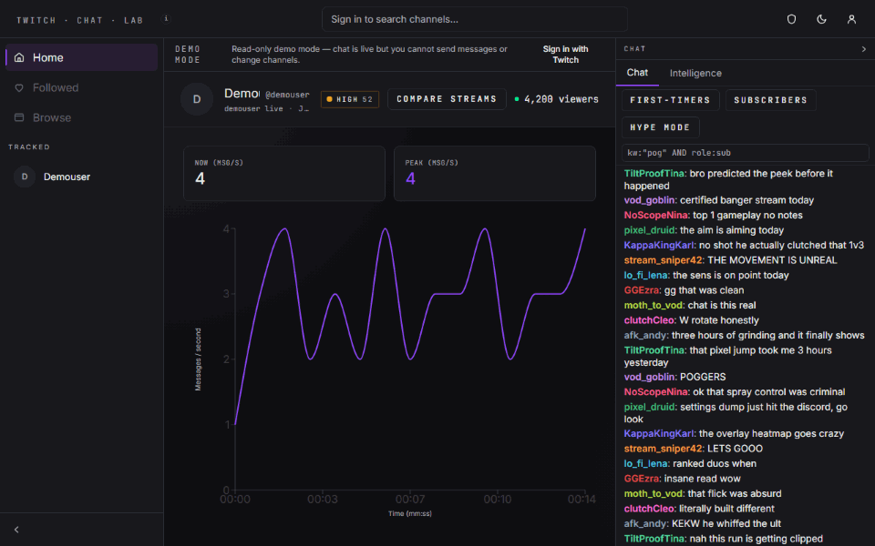
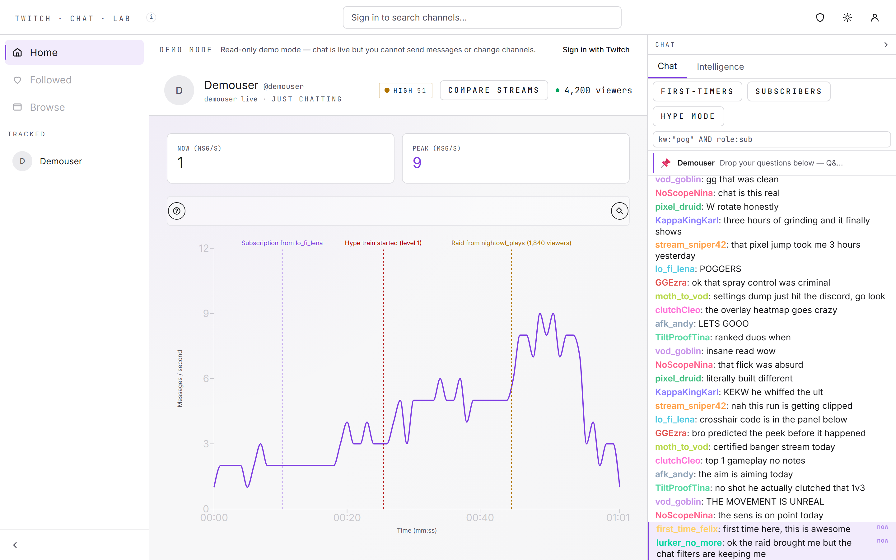
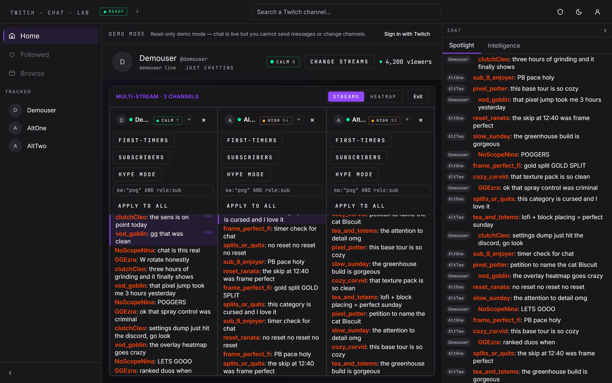
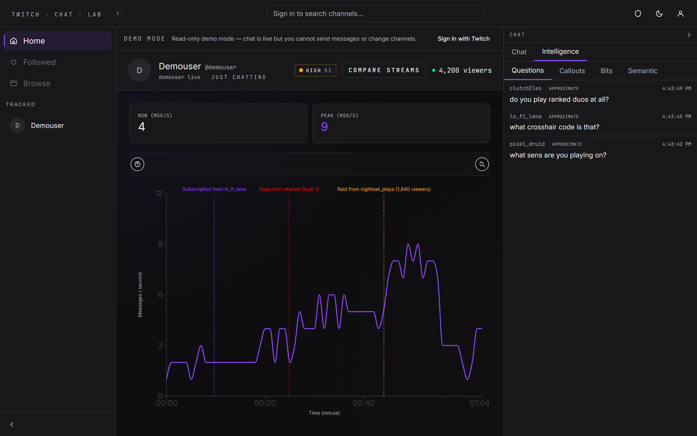
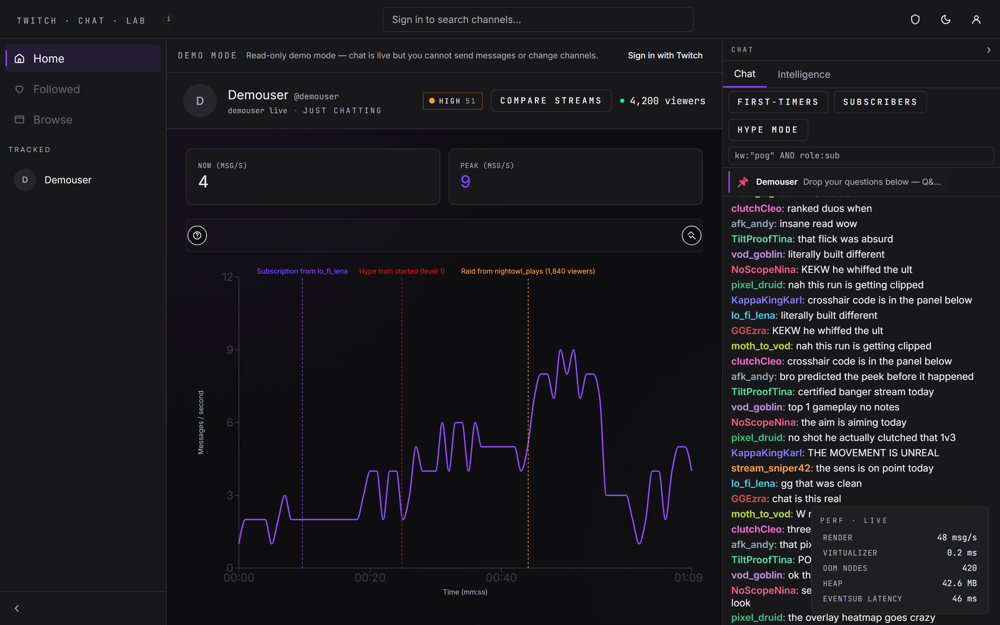
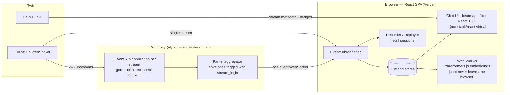

# Twitch Chat Lab

A high-throughput Twitch chat interface with engagement instrumentation, smart filters, and a multi-stream comparison view.

Captured from the running app in demo mode with a scripted session — every README visual regenerates via [`docs/media/capture.mjs`](docs/media/capture.mjs).

## Live demo

**https://twitch-chat-lab.vercel.app/?demo=1**

No login required — read-only demo against a popular live channel.

<picture>
  <source media="(prefers-color-scheme: dark)" srcset="docs/media/hero.png">
  
</picture>

## Features

- **Real-time virtualized chat** — `@tanstack/react-virtual` sustains > 1k msg/s with bounded DOM (verified by a 10,000-message integration test under happy-dom; per-frame render stays under 16 ms).
- **Live engagement heatmap** — rolling 5-minute msg/s line chart with annotated event markers for raids, subscriptions, and hype trains.
- **Four composable smart filters** — first-timers, subscribers-only, keyword, and hype-mode (velocity spikes relative to rolling 30 s average). Filters compose with **AND** logic via a pure `applyFilters` function.
- **First-time chatter spotlight** — per-session detection (first-message-in-session, not "first ever in channel" — EventSub does not expose that, and the UI tooltip says so).
- **Multi-stream chat comparison** — 2 or 3 streams in the same Twitch category, side-by-side, fanned in by a Go WebSocket proxy. One client WebSocket; the proxy maintains one EventSub connection per stream. A side dock surfaces a cross-stream Spotlight feed (stick-to-bottom auto-scroll with "Jump to latest") and an Intelligence panel whose Questions / Callouts / Bits tabs each support an **All streams** merged view with per-row source badges.
- **Performance instrumentation overlay** — `Ctrl+Shift+P` reveals render msg/s, virtualizer time, DOM node count, JS heap (Chromium-only), and EventSub end-to-end latency.

<table>
  <tr>
    <td width="50%">
      
      
Multi-stream comparison — 3 channels fanned in through the Go proxy, with the cross-stream Spotlight dock

    </td>
    <td width="50%">
      
      
Intelligence panel — questions, callouts, and bits extracted live from chat

    </td>
  </tr>
</table>

## Semantic search & moments

A client-side semantic layer runs over the live chat. On boot, the `Xenova/all-MiniLM-L6-v2` quantized ONNX model (~22 MB, one-time download, cached by the browser on subsequent loads) is fetched lazily via `requestIdleCallback` and hosted in a Web Worker that runs transformers.js off the main thread.

- **Search.** The `Semantic` sub-tab of the Intelligence panel supports cosine-similarity search: type a phrase and the top-20 message results render with score bars (0–1) and click-to-scroll into chat.
- **Moments.** A `MomentsTimeline` above the heatmap clusters interesting windows into five kinds: `spike` (msg/s burst over rolling baseline), `emote-storm` (dominant-emote density), `qa-cluster` (question concentration), `raid` (raid-risk triangulation), and `semantic-cluster` (vocabulary clusters via k-means-lite).
- **Privacy.** **Embeddings run locally; no chat content leaves your browser.** Append `?semantic=0` to the URL to opt out at boot; a tooltip chip in the top nav mirrors the worker status (`loading` / `ready` / `off`).
- **Multi-stream cost.** Each additional active stream adds ~20–40 MB to the embedding cache (10k vectors × 384 × 4 bytes ≈ 15 MB + overhead), surfaced in the activation dialog.

## Record / Replay / Scrub

Every live session can be recorded to a local `.jsonl` file and replayed later with a scrub bar.

- **Record.** Press `Ctrl+Shift+R` (or `Cmd+Shift+R` on macOS) to reveal `RecorderControls`. Click Start to begin buffering EventSub frames, Stop when done, Download to save the file locally. The browser saves `tcl-session-<channel>-<iso>.jsonl`. A privacy banner confirms: recordings contain chat messages from other users; distribute locally only.
- **Hash-broadcaster-ID toggle.** Optional. When enabled, the recorder FNV-1a-hashes `broadcaster_user_id` before writing. Chatter user IDs, logins, display names, and message text stay intact so replay fidelity is preserved. The scope is deliberately narrow — the toggle is not a general anonymizer.
- **Replay.** Click Import in `RecorderControls` and select a `.jsonl` file, or append `?replay=<url>` to the page URL to auto-load a fixture. The app enters replay mode: live EventSub is not opened, the `ScrubBar` mounts above the heatmap, and frames dispatch through the same store-write path as live chat. Speed selector supports `0.5× / 1× / 2× / 5×`.
- **Scrub.** Drag the thumb to jump to any position. Chat store, heatmap, intelligence chip, and Moments timeline all re-derive from the frames up to that position (stores are replay-pure — no ambient `Date.now()` reads in actions).
- **Schema versioning.** The on-disk format is `schemaVersion: 1` (see `frontend/src/types/recording.ts`). Unknown versions surface a typed `RecorderSchemaError` on Import. Future format changes bump the constant.

## Perf demo (local)

`/stress` is a dev-only route for reproducible perf demonstrations. Not shipped to production — the route is guarded by `import.meta.env.DEV` and no nav component links to it.

- Run locally: `cd frontend && npm run dev` → visit `http://localhost:5173/stress`.
- Select a target rate (`100 / 500 / 1000 / 5000 msg/s`) and duration (seconds). Click Start. The synthetic chat generator (seeded mulberry32 PRNG — deterministic given a fixed seed) feeds messages into `chatStore` at the target rate.
- The perf overlay mounts inline; `virtualizerRenderMs` p99 stays under 16 ms at 1,000 msg/s across a 10 s window on a mid-range laptop. Record the browser during the run to produce the recruiter-facing video artifact.

## What the perf panel shows

| Metric | What it measures | Healthy range |
|---|---|---|
| **Render** | ChatMessage components rendered per second (counter, 1 s window) | Matches incoming msg/s; saturates around 1–2 k on a busy channel |
| **Virtualizer** | `performance.measure` around the virtual-items render | < 16 ms; amber above |
| **DOM nodes** | `document.querySelectorAll('*').length`, polled every 500 ms | Bounded — should not grow with message count |
| **Heap** | `performance.memory.usedJSHeapSize / 1 MB` (Chromium only; `n/a` elsewhere) | < 200 MB; amber above |
| **EventSub latency** | `Date.now() - metadata.message_timestamp`, exponentially smoothed | < 500 ms; amber above. Measures browser→Twitch round-trip. |

## Architecture

Single-stream sessions talk to Twitch directly: one EventSub WebSocket into `EventSubManager`, which routes frames into Zustand stores that the UI subscribes to by slice. Multi-stream mode goes through the Go proxy instead — one goroutine-owned EventSub connection per stream, fanned into a single client WebSocket as envelopes tagged with `stream_login`. The recorder taps the same frame stream on the way in, which is why replayed `.jsonl` sessions flow through the identical store-write path as live chat. The semantic layer never leaves the browser: a Web Worker runs transformers.js over chat text pulled from the stores.

## Tech decisions

### `@tanstack/react-virtual` over `react-window`

Better TypeScript support, smaller public API, and built-in dynamic measurement for variable-height rows. Result: every chat row can render rich content (emotes, badges, multi-line messages) without pinning `estimateSize` to the tallest case.

### Zustand over Redux

The only state-consumer pattern in this app is "subscribe to a slice." Zustand does that natively (`useChatStore((s) => s.messages)`) without selectors + `React.memo` wrappers + `useSelector` + action creators + reducers. Less ceremony, same correctness, hooks-native.

### Go proxy over a Node proxy

Three reasons:

1. **Go concurrency primitives fit the problem** — goroutines per upstream, `chan []byte` fan-in, `context.Context` propagation for cascade teardown, exponential backoff on reconnect.
2. **Single-binary deploy** on Fly.io. ~15 MB distroless image, no Node runtime to configure.
3. **Fan-in ergonomics.** No Node WebSocket library matches `select { case <-ctx.Done(): … case frame := <-upstream: … }` for multi-source aggregation.

### Implicit Grant over PKCE

Twitch does **not** support PKCE for Authorization Code Grant (confirmed via Twitch OAuth docs as of 2026). For a browser-only SPA with no server secret, Implicit Grant is the supported path. Tokens live in memory only — page reload re-authenticates. A 5-minute `/oauth2/validate` poll catches revocation (except in demo mode — see Known limitations).

## Known limitations

- **Demo token rotation.** Implicit Grant has no refresh token. When the cached demo token expires, the live demo breaks until it is manually rotated.
- **First-timer detection is per-session.** EventSub's `channel.chat.message` does not expose `is_first_message` (the old IRC `first-msg` tag was not carried over). The UI labels accordingly — "first this session," not "first ever in channel."
- **`jsHeapUsedMB` is Chromium-only.** `performance.memory` is a non-standard API. Firefox and Safari show `n/a` with a tooltip.
- **Non-own-channel viewing degrades to chat-rate-only.** Twitch returns 403 for `channel.subscribe` / `channel.hype_train.*` subscriptions on channels the authed user does not own. The chat feed and heatmap velocity still work; event markers (raids, subs, hype) only appear for your own channel. The UI calls this out.
